# 徐俊飞 | Go 后端工程师 / 技术负责人

> Backend Engineer / Tech Lead  
> Go · Microservices · DDD · CloudWeGo  
> Open to opportunities in Shanghai

---

## 👋 About Me

- 4 年后端研发经验，主栈 **Go / Python**
- 主导公司 **Python 单体 → Go 微服务架构** 转型
- 从 0 到 1 设计并落地 **医疗放射治疗数据管理平台**
- 担任技术负责人，带领 **8 人团队**
- 系统已在 **52 家医院** 生产环境稳定运行

我专注于 **可落地的系统架构设计**，擅长在真实业务压力下做技术决策，而不是停留在概念层。

---

## 🧠 Technical Focus

- **Go Microservices**：CloudWeGo（Kitex / Hertz）、gRPC
- **Architecture**：DDD 分层架构、IDL-First、仓储模式
- **Distributed Systems**：服务治理、数据一致性、可观测性
- **Data Platform**：Trino 数据湖、多数据源集成
- **Auth & Permission**：Casbin（RBAC / ABAC）
- **Engineering**：Docker、环境变量驱动配置、工程化规范
- **Domain**：医疗信息系统、DICOM 医疗影像

---

## 🚀 Featured Project

### Radius · 医疗放射治疗数据管理平台

**Role**：Tech Lead / Architect  
**Background**：医疗放疗领域核心数据平台，从 0→1 构建生产级系统  

**System Scale**
- 10 个微服务
- 48 个 Thrift IDL
- ~77,600 行 Go 核心业务代码

**Key Responsibilities**
- 设计并落地基于 **DDD 的微服务架构**
- 构建 **数据湖服务**，支持跨数据源查询（Trino）
- 设计并实现 **权限管理系统**（Casbin）
- 推动系统容器化与工程化标准建设
- 支撑系统在 **52 家医院** 的部署与长期稳定运行

📐 Architecture overview  

---

## 📄 Resume

- 👉 [HTML Resume](./resume.html)
- 👉 [PDF Resume](./resume.pdf)

（HTML 版本更完整，适合技术负责人查看）

---

## 📫 Contact

- Email: masonsxu@foxmail.com  
- GitHub: https://github.com/masonsxu  

> Feel free to reach out via email for professional opportunities
> Currently open to **Backend Engineer / Tech Lead** roles  
> Prefer **Go / Microservices / System Architecture** oriented teams
