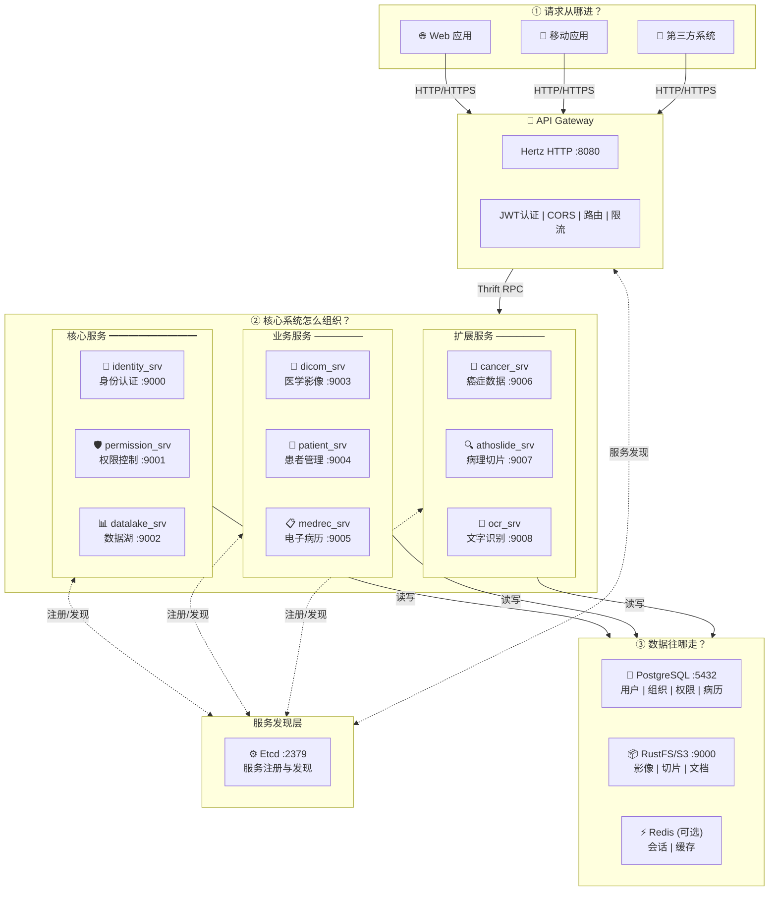
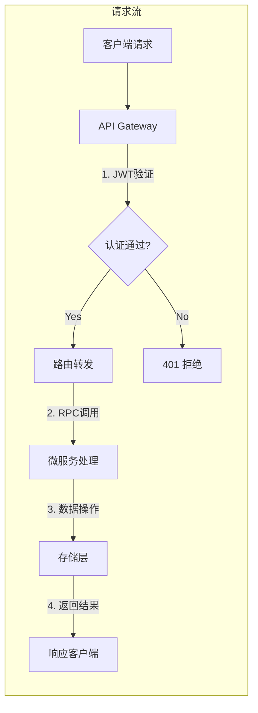
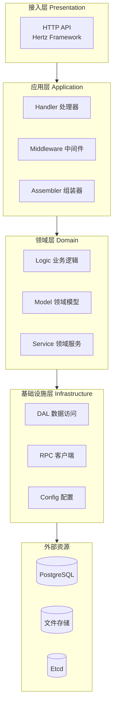

# Radius 系统架构图

> 基于 radius-backend 项目实际架构分析绘制

## 整体架构视图

## 数据流向图

## 服务分层架构

## 核心架构特点

| 层次 | 技术选型 | 职责 |
|:-----|:---------|:-----|
| **接入层** | Hertz HTTP | 统一入口、认证鉴权、协议转换、流量控制 |
| **服务层** | Kitex RPC + Thrift | 业务逻辑处理、服务间通信、领域隔离 |
| **发现层** | Etcd | 服务注册、动态发现、配置管理 |
| **存储层** | PostgreSQL + S3 | 结构化数据持久化、文件对象存储 |
